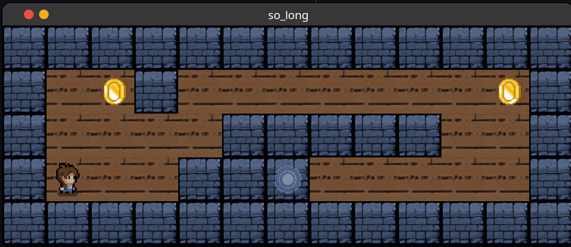

# So_long 🎮

## Description

So_long is a 2D game project using the minilibx. The goal is to collect all the collectibles and reach the exit.

## Installation

```bash
make
```

## How to run

```bash
./so_long maps/map.ber
```

## Screenshots



## License

[MIT](https://choosealicense.com/licenses/mit/)
